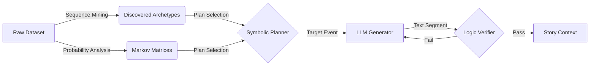

# Neuro-Symbolic Story Engine (Research Preview)


> **Paper ID #8821 Implementation**  
> A hybrid AI architecture combining **Sequence Mining (Structure Learning)** and **Large Language Models (Generative)** to solve the "Long-Term Coherence" problem in automated storytelling.


## 🧠 Abstract

Large Language Models (LLMs) often suffer from "context drift" and structural degradation in long-form generation. This project implements a **Neuro-Symbolic** approach that first **mines narrative archetypes** from a dataset and then uses them to constrain generation.

The architecture consists of two systems:
1.  **System 1 (Symbolic Planner):** Uses **Sequence Mining** to extract "Golden Paths" (Archetypes) from data and **Markov Chains** for probabilistic state tracking.
2.  **System 2 (Neural Generator):** An LLM (Gemini 2.5 Flash or Mistral Small) writes the prose, strictly constrained by System 1's structural blueprint.
3.  **Verifier Loop:** A simulated NLI (Natural Language Inference) module rejects outputs that do not match the symbolic plan.

## ✨ Key Features

*   **Narrative Archetype Mining:** Analyzes raw story datasets to discover repeating structural patterns (e.g., *"Twisted Thriller Arc"* vs. *"Classic Hero Arc"*).
*   **Dual-Mode Control:**
    *   **Probabilistic Mode:** Generates unique structures using Time-Sliced Markov Chains.
    *   **Archetype Mode:** Forces the engine to follow a specific, mined "Golden Path" for maximum structural coherence.
*   **Dual-Pipeline Comparison:** Run the Neuro-Symbolic engine alongside a standard "Vanilla" LLM to visualize improvements in real-time.
*   **Matrix Visualizer:** Watch the Symbolic Planner weigh probabilities ($P(E_{t+1}|E_t)$) versus the enforced Archetype path.
*   **Performance HUD:** Real-time metrics including **CSR (Constraint Satisfaction Rate)**, **Self-BLEU (Diversity)**, and **Vocabulary Richness**.

## 🛠️ Architecture



## 🚀 Getting Started

### Prerequisites
*   Node.js (v18+)
*   Google Gemini API Key **OR** Ollama installed locally.

### Installation

1.  **Clone the repository**
    ```bash
    git clone https://github.com/yourusername/neuro-symbolic-engine.git
    cd neuro-symbolic-engine
    ```

2.  **Install Dependencies**
    ```bash
    npm install
    ```

3.  **Set API Key**
    *   Create a `.env` file or export the variable:
    ```bash
    export API_KEY="your_gemini_api_key"
    ```

4.  **Run Application**
    ```bash
    npm start
    ```

### Using Local Models (Ollama)
To use the engine without API costs:
1.  Install [Ollama](https://ollama.com).
2.  Pull the required model:
    ```bash
    ollama pull mistral-small:24b
    ```
3.  Enable CORS (Required for browser access):
    ```bash
    OLLAMA_ORIGINS="*" ollama serve
    ```
4.  Select **"Local Ollama"** in the Engine Control panel.

## 📊 Metrics Explained

*   **CSR (Constraint Satisfaction Rate):** The percentage of generated segments that aligned with the Symbolic Plan on the *first attempt*. Higher is better.
*   **Self-BLEU:** A diversity metric. Measures how much the model repeats itself. Lower scores indicate richer, more varied prose.
*   **Tension Arc:** A visualization of the story's dramatic structure, ensuring a proper Climax and Resolution.

## 📜 License

This project is licensed under the MIT License - see the [LICENSE](LICENSE) file for details.

---
*Built for the Neuro-Symbolic Research Initiative.*